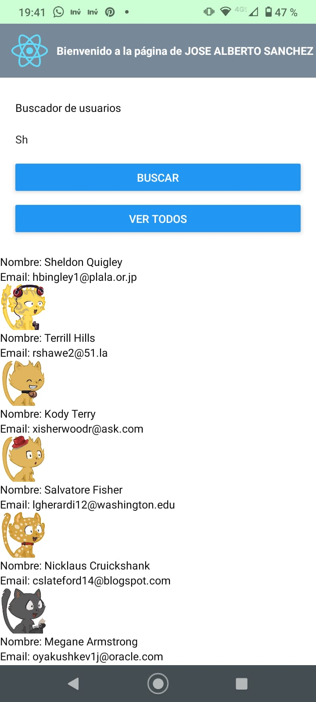

# User Search example using React Native

This code show an example to search users and render the user list using React Native.

<!--  -->

## Setup

1. Install Expo Go https://reactnative.dev/docs/environment-setup?guide=quickstart
2. Install dependencies `npm install`
2. Run project `npx expo start`

